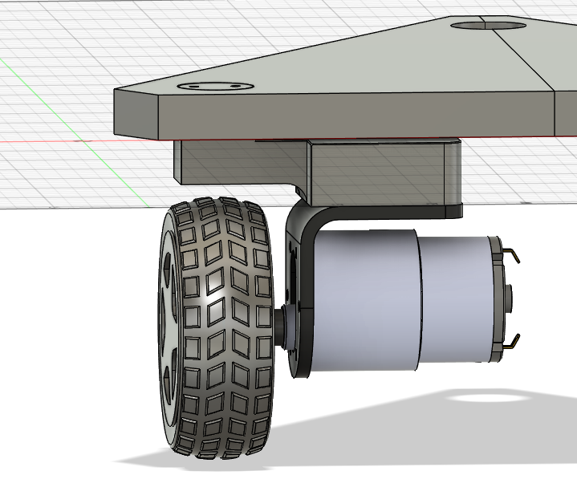

**Total Time Spent: 15h**

# June 8th: Did some research on ordered parts

I had a version of this project on the backburner last year, and It came to a grinding halt as I had no budget and I realized the parts I had didn't fit my goal.
Since then the entire project has been lost somewhere on an old hard drive (probably in my shed), and I thought that now would be a great time to pick it back up!

Today, I didn't start too much with engineering, instead I look and found some pieces online which I believe at this moment will fit my purpose.

A 20kg 0.10s/60deg servo
 - I have some old 10kg servos but they struggled a lot on the old version of this project, so I'm bumping up. These are also ridiculously cheap for some reason
A N20 500rpm geared motor
 - My last motors were standard TT gearbox motors, and I think these are a good step up in speed and handling
A 6V 2000mAh rechargeable battery pack
 - I'll be damned if I do one more project with individual cells instead of a battery pack. Given the specs of everything else I'm using: Arduino mega, 3 servos, 3 motors, this should last around two to four hours; Otherwise known as great mileage.
 
At the moment no photos because they are all still online, however this research did take me some time. 
It is very preliminary so things probably will change

**Total time spent: 2h**

# June 9th

#### Budget update info
At the start, I updated my budget, as I realized that the 150 budget was in USD instead of CAD. I also moved a lot of my items to AliExpress because it is a lot cheaper
As a result of this I was also able to fit an Arduino Due on the budget, with an additional $30 left (Needed because I need the floating point operations to be fast, also I am comfortable with arduino).
 
 
#### Modify standard TT wheel design

I also started a decent 3D model, and imported the motors/servos into my 3D model to start modeling around.

I realized that the default Arduino TT wheel model (yellow wheel) didn't have a matching attachment point for the motor to the ones I am planning on using, so I changed that and sent a model out to 3D print from PETG (grey). I'm happy how it turned out.
The 3D model with the new motor is pictured on the right.

Seeing as it works suitably as a replacement, I'm going to now pivot towards the frame of the car
 
 

#### Car frame

The best shape for a tri-wheel swerve drive, as it has the most stability parity in every direction

I created a new document, and made sketch of equilateral triangle with 250 edge length, then put some holes in for the modules to go.

The wheel modules are equidistant from the center and their respective corners. They should be in a close enough spot to the edge to keep stability and to allow space for other components

 
 

#### Wheel rotator module

I then started to build a crab drive module in CAD.

Based on previous experiences trying and failing to make this, I know that the module needed to be:

 1. IT NEEDS TO BE SIMPLE: overcomplicating things leads to easily breakable parts, which isn't good for reliability. 
 2. Wheel needs to stay in the centre, and the servo needs to be directly over the wheel: This isn't really from any previous experience, just something I thought of while making the model to help with the rotation coding later on. It also does mean that the connection from the servo to the motor needs to be a kind of L-shape though

Ok, after a few hours, I came up with this preliminary design:

It has a few issues, for example the possibility of friction between the base and the module, and the fact that if this module does a full spin, then the wires will get caught. I think that these issues can be resolved in time, but for tonight I've done a lot of work and am tired.

**Total time spent: 6h**

# June 10th: Cadding away
A tentative 3D print of the base (pictured left), made me realize that I forgot a connection mechanism between the two halves of the base ( two halves because my 3D printer isn't big enough), so I went and added it in CAD (pictured right)

#### Wheel rotator

I finished the initial design of the wheel rotator module, and I created a raised platform for the rest of the car

For the wheel rotator module, I added a connector piece to connect the servo and the rest of the module

The plug shape of the connector should be a sturdy fit when rotating

Then, I created this piece to attach the servo to the base frame. I then did a 3D print of it and I haven't been able to bend it easily, so I think it is a solid design.

One struggle i had with this was finding an appropriate JX PDI-6221MG servo model to base my designs off of, but luckily grabcad had one [here](https://grabcad.com/library/jx-pdi-6221mg-servo-180-1). I checked its measurements against those on the manufacturers website and the measurements lined up.

Unfortunately, this module made it so that screws had only a very limited space to be put, lest they interrupt the wheel/motors rotation path.

#### Frame raise

Because of that, I decided to raise part of the frame. This sketch details what is going to be raised (blue), and what is part of the motor apparatus (grey). I then extruded it to add space for the screws. Raised, pictured right

The raised section on the right side is a separate component for 3D printing purposes.

**Total time spent: 7h**
  ^ It's  summer, alright, don't judge the insane hours