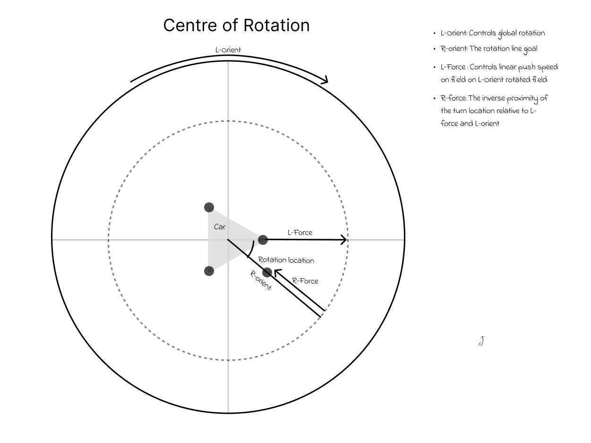

**Total Time Spent: 32h**

The initial goal for this project is a full tri-wheel car with holonomic motion. The goal is to make two drive modes: Ocelot and Crab. Ocelot is field-centric, and has full holonomic motion, however will likely require magnometer/gyro configuration and is considerably complex. Crab is car-centric, meaning it skips any magnometer/gyro configuration, and it can be a nice fallback if those components fail. It can still move in any direction, however motion is not fully holonomic.

# June 22th: Did some research on ordered parts

I had a version of this project on the backburner last year, and It came to a grinding halt as I had no budget and I realized the parts I had didn't fit my goal.
Since then the entire project has been lost somewhere on an old hard drive (probably in my shed), and I thought that now would be a great time to pick it back up!

Today, I didn't start too much with engineering, instead I look and found some pieces online which I believe at this moment will fit my purpose.

A 20kg 0.10s/60deg servo
 - I have some old 10kg servos but they struggled a lot on the old version of this project, so I'm bumping up. These are also ridiculously cheap for some reason
A N20 500rpm geared motor
 - My last motors were standard TT gearbox motors, and I think these are a good step up in speed and handling
 
At the moment no photos because they are all still online, however this research did take me some time. 
It is very preliminary so things probably will change

**Total time spent: 2h**

# June 23th

#### Budget update info
At the start, I updated my budget, as I realized that the 150 budget was in USD instead of CAD. I also moved a lot of my items to AliExpress because it is a lot cheaper
As a result of this I was also able to fit an Arduino Mega on the budget, with an additional $30 left (Needed because I need the floating point operations to be fast, also I am comfortable with arduino).
 
 
#### Modify standard TT wheel design

I also started a decent 3D model, and imported the motors/servos into my 3D model to start modeling around.

I realized that the default Arduino TT wheel model (yellow wheel) didn't have a matching attachment point for the motor to the ones I am planning on using, so I changed that and sent a model out to 3D print from PETG (grey). I'm happy how it turned out.
The 3D model with the new motor is pictured on the right.

Seeing as it works suitably as a replacement, I'm going to now pivot towards the frame of the car
 
 

#### Car frame

The best shape for a tri-wheel swerve drive, as it has the most stability parity in every direction

I created a new document, and made sketch of equilateral triangle with 250 edge length, then put some holes in for the modules to go.

The wheel modules are equidistant from the center and their respective corners, and are on the medians. They should be in a close enough spot to the edge to keep stability and to allow space for other components

 
 

#### Wheel rotator module

I then started to build a crab drive module in CAD.

Based on previous experiences trying and failing to make this, I know that the module needed to be:

 1. IT NEEDS TO BE SIMPLE: overcomplicating things leads to easily breakable parts, which isn't good for reliability. 
 2. Wheel needs to stay in the centre, and the servo needs to be directly over the wheel: This isn't really from any previous experience, just something I thought of while making the model to help with the rotation coding later on. It also does mean that the connection from the servo to the motor needs to be a kind of L-shape though

Ok, after a few hours, I came up with this preliminary design:

It has a few issues, for example the possibility of friction between the base and the module, and the fact that if this module does a full spin, then the wires will get caught. I think that these issues can be resolved in time, but for tonight I've done a lot of work and am tired.

**Total time spent: 6h**

# June 24th: Cadding away
A tentative 3D print of the base (pictured left), made me realize that I forgot a connection mechanism between the two halves of the base ( two halves because my 3D printer isn't big enough), so I went and added it in CAD (pictured right)

#### Wheel rotator

I finished the initial design of the wheel rotator module, and I created a raised platform for the rest of the car

For the wheel rotator module, I added a connector piece to connect the servo and the rest of the module

The plug shape of the connector should be a sturdy fit when rotating

Then, I created this piece to attach the servo to the base frame. I then did a 3D print of it and I haven't been able to bend it easily, so I think it is a solid design.

One struggle i had with this was finding an appropriate JX PDI-6221MG servo model to base my designs off of, but luckily grabcad had one [here](https://grabcad.com/library/jx-pdi-6221mg-servo-180-1). I checked its measurements against those on the manufacturers website and the measurements lined up.

Unfortunately, this module made it so that screws had only a very limited space to be put, lest they interrupt the wheel/motors rotation path.

#### Frame raise

Because of that, I decided to raise part of the frame. This sketch details what is going to be raised (blue), and what is part of the motor apparatus (grey). I then extruded it to add space for the screws. Raised, pictured right, sketch, pictured left.

The raised section on the right side is a separate component for 3D printing purposes.
It should slide in to the main section with no screws (tolerance of 0.1mm).

**Total time spent: 7h**
  ^ It's  summer, alright, don't judge the insane hours

# June 25th: Working on the raised section

I found a severe issue with the raised section: It doesn't fix the issue I had:

I thought that I would be able to put the Arduino on the top half, and the motor drivers (BTS7960) /batteries on the bottom half, but as it turns out, the motor drivers interfere with the pins which attach the frame together, so I can't place them on the bottom, this means thatI am back where I started in terms of placement. (left)

I fixed it by expanding the center section out on the sides, and the piece should still fit onto my 3D printer. (right)

 
 

#### Updating goals

I still think that full field-centric holonomic motion for this bot would be really cool, I would need a magnometer, which while inside my budget, has a level of complexity involved in the calibration/operation that I can't seem to wrap my head around. Also, this saves me from having to CAD in another raised platform to minimize hard iron distortions. I will from here scrap my idea of having multiple drive modes and focus solely on Crab drive, where you can move in all directions but it is robot-centric.

With that, however, I believe that this part of the CAD process done. Now I can move on to circuit diagrams and programming.

 I will need to go back to 3D modelling for the controller, but I think I'll take this one step at a time

### Circuits

The process of creating the circuit for what I need shouldn't be too difficult. All I need to do should be:

- Boot up Fritzing ( The circuit software I'm using, I will ignore the PCB section as I am not creating any)
- Add the Arduino Due, NRF24L01 (which I'm using for radio), 3 BTS7960 motor drivers, 3 servos, and 3 dc motors (I can use generic ones here because the inputs are the same)
- Connect all the wires to their appropraite handlers: 5v + arduino handles logic, 7.4V supply handles power

Unfortunately given that the BTS7960 isn't built in to Fritzing, I had to look for a user-made one, and the only one I could find couldn't be run in the Fritzing circuit simulator, so I'm going to have to wait to test this circuit once I have the pieces.

Also, I couldn't find the models of battery packs I am planning on using, so I just put placeholder 18650s in their place, seeing as this circuit wasn't going to be run anyways

The wiring went mostly without a hitch, and I connected everything and then verified the connections to make sure nothing was off. The only thing that bothers me is the fact that on the built-in Arduino Due module, the usb-b mini ports and the SPI pins weren't added into the module, so I couldn't plug those pins in. However, I left a note to remind myself and any potential readers, so It should work just fine.

I honestly wish that something went wrong during this process, or that is was more complicated, because I think I spent the last four to five hours mindlessly connecting everything.

I think that tomorrow I should start working on the controller.
I'm getting the feeling that the planning stages (before I get the grant) of this project will be over a lot faster than I'm expecting because of the insane hours I'm putting in.

**Total time spent: 9h**

# June 26th: The controller

#### Cad

I started the measurements for my controller around an arduino mega, because it is a good size to start to model something ergonomic around, and I happen to have one laying around, so there is no point buying something new.

I think It turned out well, and I added a little IO on the controller to connect it to my computer, removing the need for a battery for this.

From there, I designed a little top hatch which fits perfectly onto the base, and can hold some HW-504 joysticks. I also left a bit of space for a rf24 radio module

The CAD for the controller was extremely simple compared to that of the car. I'm sure I will eventually make changes once I feel it in my hands, but at the moment I'm out of printer filament so I will need to get some more before I can hands-on test.

#### Circuit

The circuits for this were relatively easy compared to the car, as all I had to do was connect SPI pins to the NRF24l01 module, and connect the analog pins and power to the joysticks.

After this, I wrote the Readme.md and compiled all the external items I need into a BOM.csv, which took about an hour and a half

I also realized at this point that although the Arduino Due is a lot faster than the Arduino Mega, the fact that it runs mostly 3.3v instead of 5v is a dealbreaker for me, so I am going to switch it on my BOM, however since it has exactly the same pin locations and footprint, I can leave the CAD and circuit designs intact and drop in the Mega on my real project.

#### Drive control

I realized that now that I'm done wiring and CAD for everything else, I needed (and still need to) figure out the maths behind the drive mode
So far I realized that I will need the rotation and force from both the joysticks, so I drew up a diagram for that, but am still coming up with the car drive stuff.

Using the input only from the left joystick (movement + force), and NOT the right joystick (rotation), I came up for this movement chart for when the robot is not turning.

Now that the case for only left joystick use has been solved, it is time to look at the more general case of the right joystick being moved. The first step in this process is to find the rotation point that the robot is to rotate around, likely outside of the car. This diagram details the process of finding that point with regard to the data given by Joystick data gathering.

**Total time spent: 8h**