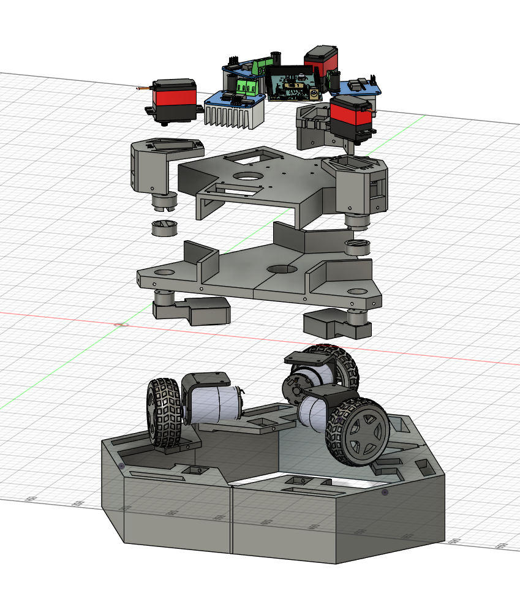

# Three wheel Crab drivetrain

**Description:** This robot can move in any direction without turning, using the Crab drive motion. It is controlled with the attached controller joysticks with the left joystick for arcade movement relative to the heading, and the right joystick to control the heading.

**Motivation:** I did this project because I wanted a challenge, also because I am looking towards joining an FRC team for the first time next year, and I wanted to make a drivetrain inspired by some robots I saw there. This project ended up taking less time than I anticipated (mostly because I was putting in 7-8 hour days on it), but it was still very fun.

**File Layout**:
 - **CAD**: contains the STEP files for the entire built, imports and all
 - **FIRMWARE**: contains all the code put on the microcontrollers
 - **WIRING**: Contains fritzing file, breadboard view and schematic view images, for both the controller and the car
 - **PRODUCTION**: Contains the individual .3mf files which will be 3D printed
 - **JOURNALIMG**: Where I store all the images I used for my journal

### Car Design Images

### Controller Design Images

### BOM

I have a lot of parts at home and 3D printing capabilities so this list is just what I don't have.

|Item #|Part Name     |Quantity|Type                   |Description              |Source    |Cost (USD)|Link                                                                                                                                                                                                                                                                                                                                                                                                                                                                                |
|------|--------------|--------|-----------------------|-------------------------|----------|----------|------------------------------------------------------------------------------------------------------------------------------------------------------------------------------------------------------------------------------------------------------------------------------------------------------------------------------------------------------------------------------------------------------------------------------------------------------------------------------------|
|1     |Arduino Mega   |1       |N/A                    |Microcontroller for car  |AliExpress|$18.6    |[link](https://www.aliexpress.com/item/1005007392480051.html)|
|2     |USB Power Bank|1       |N/A                    |Powers microcontroller   |AliExpress|$17.45    |[link](https://www.amazon.ca/Kofarrten-Battery-10000mAh-Portable-Charger/dp/B0CKZF4L5V)                                                                                                                                                                                                                                                                                                                                                                                                     |
|3     |4 20kg Servos |1       |N/A                    |Rotates motors around yaw|AliExpress|$47.79    |[link](https://www.aliexpress.com/item/32880168203.html)                                                                                                                                                                                                           |
|4     |DC motor      |4       |6V bracket motor 300rpm|The main motors          |AliExpress|$33.43    |[link](https://www.aliexpress.com/item/1005009003269281.html)                                                                                                                                                                                                                         |
|5     |Battery pack  |1       |3pcs                   |Powers motors            |AliExpress|$14.98    |[link](https://www.aliexpress.com/item/1005007104046547.html)                                                                                                          |
|6     |BTS7960       |2       |N/A                    |Motor driver             |AliExpress|$6.08     |[link](https://www.aliexpress.com/item/1005006795884033.html)                                                                                                                                                                                                                        |
|7     |Joysticks     |1       |N/A                    |Joysticks for controller |AliExpress|$3.42     |[link](https://www.aliexpress.com/item/1005009059629265.html)                                                                                                                                                                                                                    |
|8     |Shipping      |N/A     |N/A                    |N/A                      |N/A       |$20.50    |N/A                                                                                                                                                                                                                                                                                                                                                                                                                                                                                 |

Total: $160.17 USD

With tax: $180.9921 USD
^ This may be well below because of Aliexpress first time shopper discounts,
but I used the full prices even though

